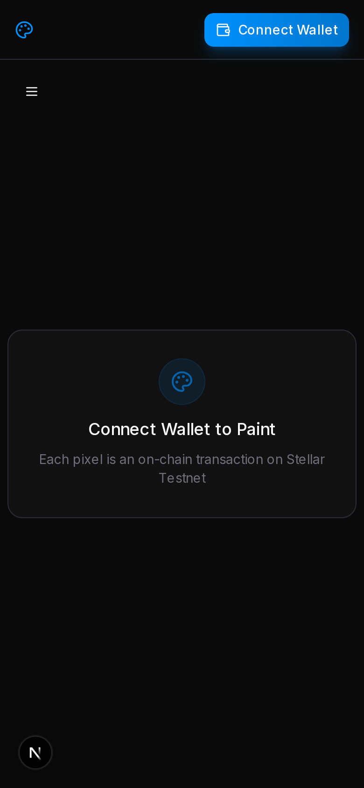
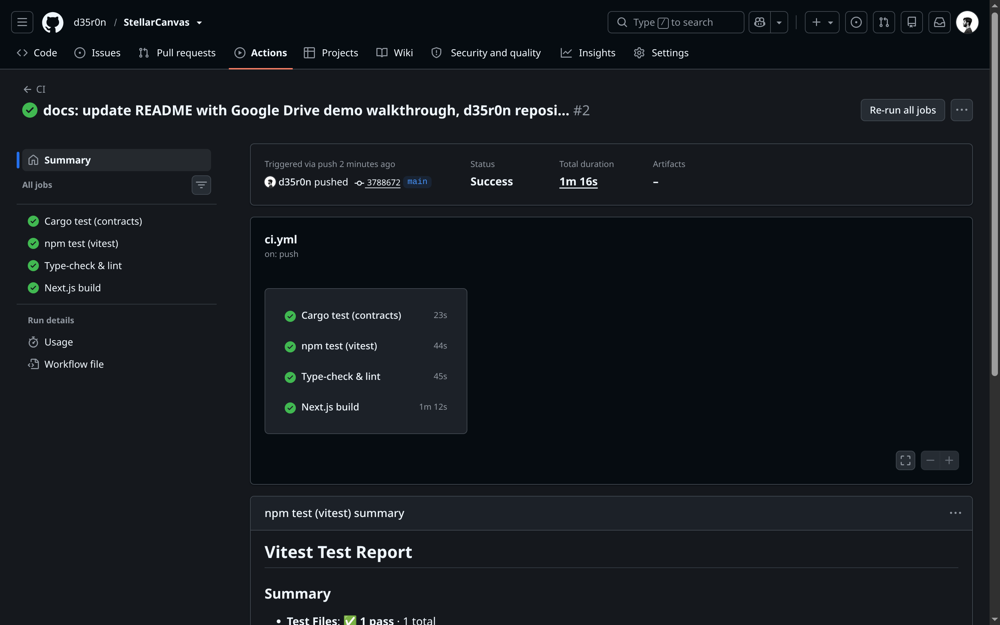
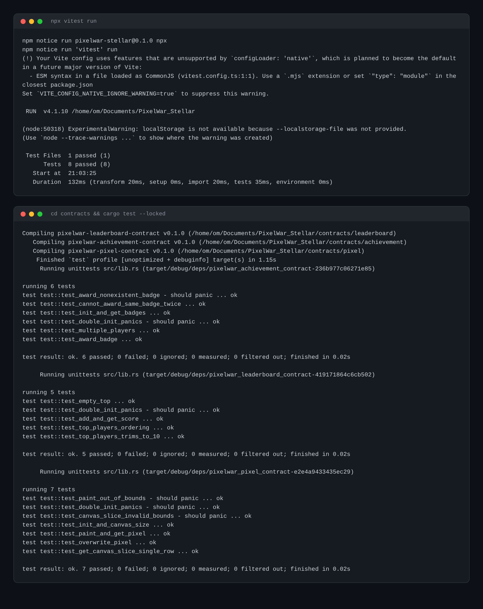

# StellarCanvas

> A collaborative on-chain 64×64 pixel canvas on Stellar Soroban. Paint pixels, earn badges, climb the leaderboard — every action is a transaction.


[](https://github.com/d35r0n/StellarCanvas/actions/workflows/ci.yml)

---

## Overview

StellarCanvas is a full-stack Web3 application that lets users connect a Stellar wallet and paint pixels on a permanent, shared canvas. Every paint is broadcast as a **Soroban smart contract invocation** on the Stellar testnet. The canvas, leaderboard, activity feed, badges, and profile update in real time from on-chain events — no polling-based API or backend server required.

## Links

- **Video Demo:** Watch the demo video [here](https://drive.google.com/file/d/1DyhUhU91143fkMwPj6bfV_zBCHx61S4W/view?usp=sharing)
- **Live Demo:** [https://stellar-canvas-nu.vercel.app/](https://stellar-canvas-nu.vercel.app/)

|                     |                                                                   |
| ------------------- | ----------------------------------------------------------------- |
| **Canvas**          | 64×64 pixels, zoom/pan/drag, local persistence                    |
| **Smart Contracts** | Pixel, Leaderboard, Achievement (Rust + Soroban SDK)              |
| **Events**          | `PixelPainted`, `BadgeAwarded` — polled from Soroban RPC          |
| **Leaderboard**     | Top 10, current user rank, per-painter pixel count                |
| **Achievements**    | NFT-style badges: First Pixel, Pixel Artist, Pixel Master, Top 10 |
| **Profile**         | Wallet, rank, pixels, badges, activity history                    |
| **Wallet**          | StellarWalletsKit (Freighter, Albedo, xBull, Lobstr)              |
| **CI/CD**           | GitHub Actions (cargo test, vitest, typecheck, lint, build)       |

---

## Architecture

```
┌─────────────────────────────────────────────────────────────┐
│  Browser (Next.js 15 + React 19)                           │
│  ┌──────────┐ ┌───────────┐ ┌────────────┐ ┌───────────┐   │
│  │ Canvas   │ │ Leaderboard│ │ Profile    │ │ Wallet    │   │
│  │ 64×64    │ │ Top 10    │ │ Stats/Badg-│ │ Connect/  │   │
│  │ paint/   │ │ live rank │ │ ges/History│ │ Disconnect│   │
│  │ zoom/pan │ │           │ │            │ │           │   │
│  └────┬─────┘ └─────┬─────┘ └─────┬──────┘ └─────┬─────┘   │
│       │             │              │              │         │
│  ┌────┴─────────────┴──────────────┴──────────────┴────┐    │
│  │              EventProvider (poll every 3s)           │    │
│  │         Soroban RPC getEvents() → listeners          │    │
│  └──────────────────────┬──────────────────────────────┘    │
│                         │                                    │
│  ┌──────────────────────┴──────────────────────────────┐    │
│  │            Contract Clients (Client.fromWasm)        │    │
│  │    paint_pixel  │  get_top_players  │  award_badge   │    │
│  └──────────────────────┬──────────────────────────────┘    │
└─────────────────────────┼───────────────────────────────────┘
                          │
      ┌───────────────────┼───────────────────┐
      ▼                   ▼                   ▼
┌───────────┐  ┌───────────────┐  ┌────────────────┐
│  Pixel    │  │  Leaderboard  │  │  Achievement   │
│  Contract │  │  Contract     │  │  Contract      │
│           │  │               │  │                │
│ paint_    │  │ add_score()   │  │ award_badge()  │
│ pixel()   │  │ get_top_      │  │ get_player_    │
│ get_canvas│  │ players()     │  │ badges()       │
│ _slice()  │  │ get_score()   │  │                │
│           │  │               │  │                │
│ Event:    │  │ Event:        │  │ Event:         │
│ Pixel     │  │ ScoreAdded    │  │ BadgeAwarded   │
│ Painted   │  │               │  │                │
└───────────┘  └───────────────┘  └────────────────┘
      │                   │                   │
      └───────────────────┼───────────────────┘
                          │
                   ┌──────┴──────┐
                   │  Stellar    │
                   │  Soroban    │
                   │  Testnet    │
                   └─────────────┘
```

**Data flow:**

1. User clicks a pixel → wallet prompts to sign a Soroban `paint_pixel(x, y, color)` invocation
2. Transaction confirmed → `PixelPainted` event emitted on-chain
3. `EventProvider` (polling `getEvents` every 3s) picks up the event and notifies all subscribers
4. Canvas renders the new pixel, leaderboard re-ranks, activity feed prepends the entry, toast fires

**Contract storage constraints:**

- Soroban persistent storage has a 100‑entry read budget per invocation. Reading all 4,096 pixels in one call exceeds the budget.
- `get_canvas_slice(start_row, end_row)` returns one row (64 entries) per call — clients assemble the full canvas in 64 sequential reads.
- Leaderboard can't enumerate persistent storage keys. A `PlayerList` (Vec<Address>) in instance storage tracks all players.

---

## Folder structure

```
StellarCanvas/
│
├── .github/workflows/
│   └── ci.yml                    # cargo test + vitest + typecheck + lint + build
│
├── contracts/                    # Soroban smart contracts (Rust workspace)
│   ├── Cargo.toml               # Workspace: pixel, leaderboard, achievement
│   ├── pixel/src/lib.rs         # 64×64 canvas storage + paint/get/slice
│   ├── leaderboard/src/lib.rs   # Top-N scoring with PlayerList iteration
│   ├── achievement/src/lib.rs   # 4 badge definitions, award/has/player badges
│   └── target/                  # Compiled wasm (served to frontend for spec)
│
├── public/wasm/                  # Compiled wasm blobs for Client.fromWasm()
├── scripts/                     # Wasm spec extraction helpers
│
├── src/
│   ├── app/
│   │   ├── page.tsx             # Landing page (hero, features, footer)
│   │   ├── layout.tsx           # Root layout (WalletProvider, EventProvider, Toaster)
│   │   └── dashboard/
│   │       ├── page.tsx         # Canvas page
│   │       ├── leaderboard/page.tsx   # Full leaderboard
│   │       └── profile/page.tsx       # User profile
│   │
│   ├── components/
│   │   ├── dashboard/
│   │   │   ├── pixel-canvas.tsx       # 64×64 <canvas> with forwardRef
│   │   │   ├── connected-canvas.tsx   # Wallet-connected canvas + paint flow
│   │   │   ├── color-picker.tsx       # 24 presets + custom hex input
│   │   │   ├── leaderboard-table.tsx  # Top 10 + user stats
│   │   │   ├── sidebar-left.tsx       # Mobile/desktop navigation
│   │   │   ├── sidebar-right.tsx      # Live activity feed + mini leaderboard
│   │   │   ├── profile.tsx            # Wallet card, stats, badges, history
│   │   │   └── top-bar.tsx            # Glass header with wallet button
│   │   ├── landing/                   # Hero, Features, Footer
│   │   ├── layout/                    # Navbar
│   │   ├── wallet/                    # WalletButton (connect/disconnect/balance)
│   │   └── ui/                        # shadcn/ui primitives
│   │
│   ├── providers/
│   │   ├── wallet-provider.tsx  # StellarWalletsKit state, connect, disconnect
│   │   └── event-provider.tsx   # Polls getEvents for PixelPainted + BadgeAwarded
│   │
│   ├── lib/
│   │   ├── constants.ts         # Network, RPC URL, contract IDs, canvas size
│   │   ├── contracts.ts         # Client.fromWasm() factory for all 3 contracts
│   │   ├── utils.ts             # cn(), truncateAddress()
│   │   └── utils.test.ts        # Unit tests (vitest)
│   │
│   └── types/
│       └── wallet.ts            # WalletState, WalletAction types
│
├── vitest.config.ts             # Vitest with @/ path alias
├── tsconfig.json
├── next.config.ts
├── package.json
└── SPEC.md                      # Detailed feature specification
```

---

## Features

### Canvas (`/dashboard`)

- 64×64 pixel grid rendered on a single `<canvas>` element (not DOM nodes)
- Click to paint, drag to paint continuously
- Scroll to zoom (0.5× – 20×), Ctrl/Cmd+click to pan
- Hover cell highlight with border glow
- Local persistence via `localStorage` (canvas survives page reload)
- Canvas dims during transaction, prevents double-paint
- Inbound live events push pixels onto canvas in real time

### Paint Flow

```
Click Pixel → Open Wallet → Sign Transaction → Broadcast → Update UI
                                                              ↓
                                              Loading → Tx Hash → Error
```

- **Signing**: spinner + "Open your wallet to sign…"
- **Submitting**: spinner + "Submitting to the network…"
- **Success**: green dot, tx hash link to stellar.expert
- **Error**: red alert with message; user-rejected = silent reset

### NFT Badges

- Awarded automatically when pixel count hits thresholds:
  - **First Pixel** (1 paint)
  - **Pixel Artist** (10 paints)
  - **Pixel Master** (100 paints)
  - **Top 10** (reaches top 10 on leaderboard)
- `get_player_badges()` reads earned badges from chain
- Toast fires on badge award; profile refreshes instantly

### Leaderboard (`/dashboard/leaderboard`)

- Reads top 10 from on-chain `get_top_players()`
- User's own rank and score highlighted in a stats banner
- Gold/silver/bronze medals for ranks 1–3
- Live sorting via event stream — re-ranks on every `PixelPainted` event
- Manual refresh button

### Activity Feed (sidebar)

- Real-time event stream in right sidebar
- Each entry: `GABC…XYZ1 painted (12, 34) 2m ago`
- Pulsing green dot = active polling
- 50-entry buffer, newest first

### Profile (`/dashboard/profile`)

- Wallet card: address, copy button, XLM balance, explorer link
- Stat cards: Pixels Painted, Rank, Badges earned
- Achievement grid: 4 badges shown earned (purple + star) or locked (grey)
- Recent activity: last 30 paints with color swatches and timestamps

### Event Streaming

- `EventProvider` polls `getEvents` against both `CONTRACT_PIXEL` and `CONTRACT_ACHIEVEMENT` every 3s
- Two independent cursors — maintains position across 3‑second intervals
- Deduplication by event ID
- All events buffered up to 200 in state; listeners receive union `StreamEvent` type
- Auto-stops polling on wallet disconnect

---

## Setup

### Prerequisites

- **Node.js** ≥ 22
- **npm** ≥ 10
- **Rust** (stable) with `wasm32v1-none` target

```bash
rustup target add wasm32v1-none
```

### 1. Clone & install

```bash
git clone https://github.com/d35r0n/StellarCanvas.git
cd StellarCanvas
npm install
```

### 2. Compile smart contracts

```bash
cd contracts
cargo build --target wasm32v1-none --release
cd ..
```

Copy wasm blobs to the public directory:

```bash
cp contracts/target/wasm32v1-none/release/stellarcanvas_pixel_contract.wasm public/wasm/
cp contracts/target/wasm32v1-none/release/stellarcanvas_leaderboard_contract.wasm public/wasm/
cp contracts/target/wasm32v1-none/release/stellarcanvas_achievement_contract.wasm public/wasm/
```

### 3. Run the development server

```bash
npm run dev
```

Open [http://localhost:3000](http://localhost:3000).

> **Note:** The application connects to **Stellar Testnet**. You'll need a testnet-funded wallet (Freighter, Albedo, xBull, or Lobstr). Get testnet XLM from the [Stellar Laboratory](https://laboratory.stellar.org/#account-creator?network=test).

### 4. Run tests

```bash
# Frontend (vitest)
npm test

# Smart contracts (Rust)
cd contracts && cargo test
```

---

## Contracts

| Contract                                 | Purpose                                                                                | Key Functions                                                                    |
| ---------------------------------------- | -------------------------------------------------------------------------------------- | -------------------------------------------------------------------------------- |
| **Pixel** (`CONTRACT_PIXEL`)             | Stores the 64×64 canvas. Each pixel = `{ owner, color, timestamp }`.                   | `paint_pixel`, `get_pixel`, `get_canvas_slice`, `canvas_size`, `get_pixel_count` |
| **Leaderboard** (`CONTRACT_LEADERBOARD`) | Tracks per-player pixel counts. Maintains a `PlayerList` (Vec<Address>) for iteration. | `add_score`, `get_score`, `get_top_players`                                      |
| **Achievement** (`CONTRACT_ACHIEVEMENT`) | Defines 4 badges. Stores awarded badges per player in a `Map<u32, bool>`.              | `award_badge`, `get_player_badges`, `get_all_badges`, `has_badge`                |

### Events

| Event          | Emitted By  | Topics                              | Data                             |
| -------------- | ----------- | ----------------------------------- | -------------------------------- |
| `PixelPainted` | Pixel       | `["PixelPainted", painter_address]` | `{ x: u32, y: u32, color: u32 }` |
| `BadgeAwarded` | Achievement | `["BadgeAwarded", player_address]`  | `{ badge_id: u32 }`              |

### Contract IDs (Testnet)

Deployed and initialized on Stellar Testnet. Set in `src/lib/constants.ts`:

```ts
export const CONTRACT_PIXEL =
  'CCQ3U7NX375CXWPAIO6UCNUL6EECMJZGRR5QKMDIRQU4VK3QZ5GZVA7V';
export const CONTRACT_LEADERBOARD =
  'CBRYKGEWNAB2K6GCMNCYVHGQUDU42IKVI6L6CRHNWWELR2JJV7XB3XTB';
export const CONTRACT_ACHIEVEMENT =
  'CAQJMYET2T3NAEK6SRKB2CPXUIBI3O4EF3GTMVRTBNHAAJWMGOKTQ3ZA';
```

View live on [stellar.expert](https://stellar.expert/explorer/testnet/contract/CCQ3U7NX375CXWPAIO6UCNUL6EECMJZGRR5QKMDIRQU4VK3QZ5GZVA7V) (Pixel contract).

---

## Deployment

### Frontend (Vercel)

```bash
npx vercel --prod
```

The Next.js app builds to static + server-rendered pages. No environment variables required.

### Contracts (Stellar Testnet)

```bash
stellar contract deploy \
  --wasm public/wasm/stellarcanvas_pixel_contract.wasm \
  --network testnet \
  --source <SECRET_KEY> | tail -1

stellar contract invoke --id <CONTRACT_ID> --network testnet \
  --source <SECRET_KEY> \
  -- init --admin <ADMIN_ADDRESS>
```

See [`DEPLOY.md`](./DEPLOY.md) for the full sequence across all three contracts.

---

## Screenshots

### Mobile responsive UI



### CI/CD pipeline running



### Test output (26 passing: 8 vitest + 18 contract tests)



---

## Future improvements

- [ ] **Leaderboard ↔ Pixel integration**: currently the pixel contract doesn't call `add_score()` on the leaderboard. Wire `paint_pixel` to also invoke the leaderboard contract so scores update on-chain.
- [ ] **Top 10 badge auto-award**: invoke `award_badge(badge_id=4)` when a player enters the top 10.
- [ ] **Full canvas sync on connect**: read all 64 rows via `get_canvas_slice` and hydrate the local grid from chain state.
- [ ] **Testnet → Mainnet switch**: add a network toggle; currently hardcoded to testnet.
- [ ] **Mobile optimizations**: pinch-to-zoom on canvas, compact sidebar layout.
- [ ] **Notification sound** on incoming paint events.
- [ ] **Gasless transactions**: explore sponsored Soroban transactions so players don't need XLM.
- [ ] **paint timer / cooldown**: prevent spam by enforcing a time-based cooldown per wallet.
- [ ] **Leaderboard time-window filters**: "Top 10 this week/month".
- [ ] **Canvas replay**: time-lapse playback of all paint events.
- [ ] **E2E tests** with Playwright.
- [ ] **GraphQL API** for external leaderboard/canvas queries.

---

## Tech stack

| Layer         | Technology                           |
| ------------- | ------------------------------------ |
| Frontend      | Next.js 15, React 19, TypeScript 5.7 |
| Styling       | Tailwind CSS 4, shadcn/ui            |
| Animations    | Framer Motion 12                     |
| Wallet        | @creit-tech/stellar-wallets-kit 2.5  |
| SDK           | @stellar/stellar-sdk 16              |
| Contracts     | Soroban SDK 26, Rust (no_std)        |
| Testing       | vitest 4, Rust test harness          |
| Notifications | sonner                               |
| CI/CD         | GitHub Actions                       |
| Hosting       | Vercel                               |

---

## License

MIT
